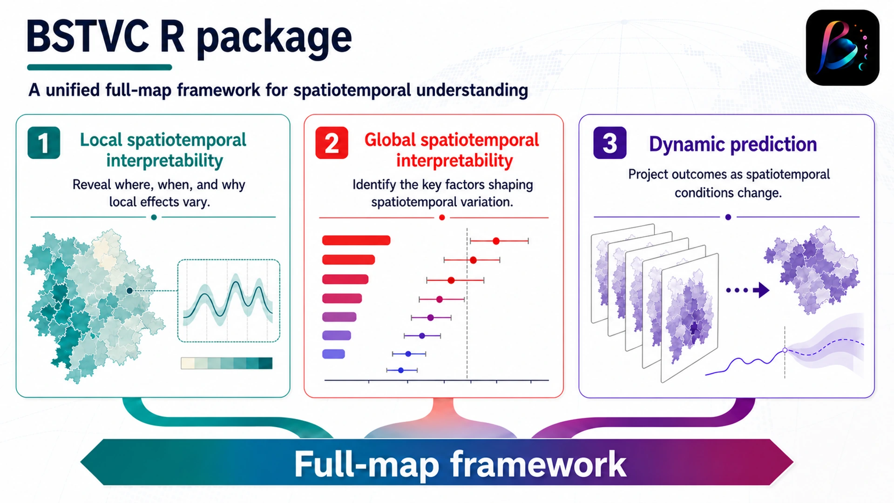

<!-- README.md is generated from README.Rmd. Please edit that file -->

```{r, include = FALSE}
knitr::opts_chunk$set(
  collapse = TRUE,
  comment = "#>",
  fig.path = "man/figures/README-",
  out.width = "100%"
)
```

# BSTVC 

<!-- badges: start -->


[](https://doi.org/10.1016/j.ijdrr.2022.103078)

<!-- badges: end -->

**A powerful tool for ante-hoc spatiotemporal interpretable analysis.**

**Spatiotemporal heterogeneous perspective for analyzing local influencing factors (local spatiotemporal interpretability), identifying key global factors (global spatiotemporal interpretability), and making dynamic predictions, all within a unified 'full-map' framework.**

<p align="center">
  
</p>

<p align="center"><em>BSTVC unifies local spatiotemporal interpretability, global spatiotemporal interpretability, and dynamic prediction within a Bayesian full-map framework.</em></p>

## Scientific overview

BSTVC is a Bayesian modeling framework for investigating spatiotemporal
heterogeneity in relationships between an outcome and its potential
determinants. It is designed for research questions that require more than
overall association estimates: the framework characterizes where and when
local effects vary, evaluates the relative contribution of candidate factors
at the global level, and supports prediction under changing spatiotemporal
conditions. By integrating these analytical targets within one coherent
workflow, BSTVC helps researchers connect local variation, global attribution,
and predictive inference while retaining parameter uncertainty. The framework
is applicable to spatiotemporal panel and areal data in public health,
medical geography, environmental research, and related fields.

### Interpretability framework

- **Ante-hoc spatiotemporal interpretability** means that interpretability is
  built into the statistical model through explicitly estimated parameters,
  rather than approximated after fitting an opaque predictive model.
- **Local spatiotemporal interpretability** describes how the direction and
  magnitude of a variable's association with the outcome vary across space
  and time.
- **Global spatiotemporal interpretability** evaluates the overall importance
  of candidate factors in explaining spatiotemporal variation.
- **Full-map framework** refers to the unified analysis of local effects,
  global factor importance, and dynamic prediction across the complete
  study domain.

<!-- The BSTVC package offers a comprehensive and unified "full-map" geographic modeling framework designed to accurately capture spatiotemporal disparities in variable relationships. Its primary goal is to uncover spatiotemporal heterogeneous impacts of multiple explanatory variables on the target variable, i.e., spatiotemporal nonstationarity (Song et al., 2019, 2020, 2022; Wan et al., 2022).  -->

<!-- Our BSTVC package is user-friendly, catering to the in-depth needs of professionals while lowering the barriers to complex Bayesian modeling. This makes advanced Bayesian local spatiotemporal regression methods accessible to a broader user community, enabling easier analysis and interpretation of complex spatiotemporal panel data. It is applicable across a wide range of disciplines, including but not limited to public health, medical geography, environmental health, health economics, and social medicine (Song and Tang, 2025). -->

## Installation

### Install the `BSTVC` R package

Install BSTVC directly from GitHub:

``` r
# Install using the devtools package
# install.packages("devtools")
devtools::install_github("bayesianstvc/BSTVC")

# Install using the remotes package
# install.packages("remotes")
remotes::install_github("bayesianstvc/BSTVC")
```

### Install the `INLA` dependency

BSTVC uses the `INLA` package for Bayesian latent Gaussian modeling. If
`INLA` is not already available in your R environment, install it from
the official INLA repository before installing BSTVC.

``` r
# Installation details: <https://www.r-inla.org/download/>
# Extend the download timeout to 5 minutes
options(timeout = 300)
install.packages(
  "INLA",
  repos = c(
    getOption("repos"),
    INLA = "https://inla.r-inla-download.org/R/stable"
  ),
  dependencies = TRUE
)
```


## BSTVC Desktop

<a href="https://bayesianstvc.github.io/BSTVC-R/"></a>

### Chinese desktop version — BSTVC Desktop (时空可解释工具)

The Chinese desktop version, **BSTVC桌面版（时空可解释工具）**, provides a more accessible graphical workflow for spatiotemporal analysis and interpretation. Visit the [official website](https://bayesianstvc.github.io/BSTVC-R/) for the latest introduction and access information.

The English desktop version is coming soon — stay tuned.

## Scientific capabilities

The `BSTVC` R package is designed to provide a comprehensive suite of
functionalities for advanced spatiotemporal heterogeneous analysis.
Its principal scientific capabilities include:

### Model families and scientific outputs

| Analytical target | Supported model or output |
|:--|:--|
| Continuous response | Log-Gaussian regression |
| Binary response | Logistic regression |
| Count response | Poisson regression |
| Local interpretation | Spatiotemporally varying coefficient estimates |
| Global interpretation | Explainable-percentage and key-factor assessment |
| Prediction | Spatiotemporal smoothing, missing-value imputation, and forecasting |
| Model assessment | DIC, WAIC, effective number of parameters (pD), and logarithmic score (LS) |

-   **Targeting multiple types of response variables**: It supports
    three mainstream types of response variables: continuous
    (log-Gaussian regression), binary (logistic regression), and count
    (Poisson regression), accommodating various analytical scenarios.

-   **Detecting spatiotemporal heterogeneous impact mechanisms**: By
    fitting spatiotemporal regression coefficients, it reveals local
    spatiotemporal differences between explanatory variables (X) and
    response variables (Y), facilitating an in-depth analysis of
    context-specific patterns and exploring the impact mechanisms
    brought by spatiotemporal heterogeneity.

-   **Identifying spatiotemporal driving factors**: On the basis of
    identifying spatiotemporal heterogeneous impact mechanisms, it
    clarifies key driving factors by calculating the spatiotemporal
    explainable percentage, supporting geographical
    spatiotemporal attribution.

-   **Supporting spatiotemporal prediction**: By accounting for
    spatiotemporal heterogeneity in local variable relationships, the
    framework can improve model fit and predictive performance when such
    nonstationarity is present. It supports spatiotemporal missing-value
    imputation, smoothing, and forecasting.

-   **Bayesian model assessment**: It provides a comprehensive
    evaluation of Bayesian regression models, including model fitting (DIC, WAIC), complexity (pd), and prediction accuracy (LS)
    indicators, helping users fully understand model performance.

-   **Rich visualization outputs**: It provides a variety of
    spatiotemporal visualization tools and codes to help users
    examine model results and communicate spatiotemporal patterns and
    uncertainty in applied research.

The BSTVC framework integrates a **full-map modeling strategy, Bayesian
parameter uncertainty, support for missing values, and flexible spatial
weight matrices** within a unified analytical workflow.

## Usage Guide

To help you quickly and fully get started with our R package for complex
data analysis, we have prepared several detailed and comprehensive usage
guides, as follows:

| Guide | Details |
|-------------------|------------------------------|
| **User's Guide for the BSTVC R Package**  | This usage guide covers detailed example operations and important considerations for each key step, including data import, inspection, preprocessing, model fitting, result output and result visualization. You can view it in the `GetStart.Rmd` document under the `vignettes` folder, but it's in R markdown format. <br><br>If you want to download the help document in PDF format, please click [here](https://github.com/bayesianstvc/BSTVC/raw/songbi123-useguides/GetStart.pdf), the filename is [GetStart-English.pdf](https://github.com/bayesianstvc/BSTVC/raw/songbi123-useguides/GetStart.pdf). At the same time, to meet the needs of Chinese users, we have also provided a Chinese version of the usage guide, which can be downloaded and saved locally by visiting [用户手册-中文版.pdf](https://github.com/bayesianstvc/BSTVC/raw/songbi123-useguides/GetStart-Chinese.pdf). |
| **Modeling Data Processing Guide** | This usage guide demonstrates how to import the types of data required for the model and how to transform the raw data into the spatiotemporal panel data format that can be processed by the BSTVC model. The R code for achieving data processing for modeling is located in the `Data_Preproc.R` file under the `data-raw` folder. |

In the near future, we will continue to refine our documentation and
provide new help documents.

## Changelog

View detailed changelog: [CHANGELOG.md](./CHANGELOG.md)

## Project status and governance

- **Maintenance status**: Actively maintained. Bug reports and feature
  requests are reviewed through [GitHub Issues](https://github.com/bayesianstvc/BSTVC/issues).
- **Contributing**: Please read the [Contribution Guide](./CONTRIBUTING.md)
  before proposing code, documentation, examples, or scientific validation.
- **Community standards**: Participation in the project is governed by the
  [Code of Conduct](./CODE_OF_CONDUCT.md).

## Additional companion tool

### INLA Process Monitor

[INLA Process Monitor](https://github.com/bayesianstvc/inla-monitor) is a Windows companion tool for monitoring live inla.exe resource usage and comparing CPU, memory, and thread behavior. It helps users identify an appropriate thread setting and diagnose performance during Bayesian latent Gaussian model fitting. The tool runs locally and does not require a cloud service.

## Contact

We welcome and encourage user contributions, including reporting issues,
requesting new features, or submitting code changes. If you encounter
any problems when using the BSTVC package or need further assistance,
you can get support through the following means:

1.  **GitHub Issues**: Report reproducible software problems or request new
    features through the [BSTVC issue tracker](https://github.com/bayesianstvc/BSTVC/issues).
2.  **Email**: Contact [Xianteng Tang](mailto:tangxxxxt@163.com) for package
    usage questions, or [Chao Song](mailto:chaosong.gis@gmail.com) for
    questions concerning statistical methodology.
3.  **Bayesian STVC model**: <https://chaosong.blog/bayesian-stvc/>

Copyright **©HEOA-West China Health and Medical Geography Research Group**

If you are a WeChat user, you are welcome to scan the QR code to follow our research group's official account: **HealthGeography**


## References

- **Bayesian STVC series models:** Song, C., Yin, H., Shi, X., Xie, M.,
  Yang, S., Zhou, J., Wang, X., Tang, Z., Yang, Y., & Pan, J. (2022).
  Spatiotemporal disparities in regional public risk perception of
  COVID-19 using Bayesian spatiotemporally varying coefficients (STVC)
  series models across Chinese cities. *International Journal of Disaster
  Risk Reduction, 77*, 103078.

- **STVPI:** Wan, Q., Tang, Z., Pan, J., Xie, M., Wang, S., Yin, H.,
  Li, J., Liu, X., Yang, Y., & Song, C. (2022). Spatiotemporal
  heterogeneity in associations of national population ageing with
  socioeconomic and environmental factors at the global scale.
  *Journal of Cleaner Production, 373*, 133781.

- Song, C., Shi, X., & Wang, J. (2020). Spatiotemporally varying
  coefficients (STVC) model: A Bayesian local regression to detect
  spatial and temporal nonstationarity in variable relationships.
  *Annals of GIS, 26*(3), 277–291.

- Song, C., Shi, X., Bo, Y., Wang, J., Wang, Y., & Huang, D. (2019).
  Exploring spatiotemporal nonstationary effects of climate factors on
  hand, foot, and mouth disease using a Bayesian spatiotemporally varying
  coefficients (STVC) model in Sichuan, China. *Science of the Total
  Environment, 648*, 550–560.
